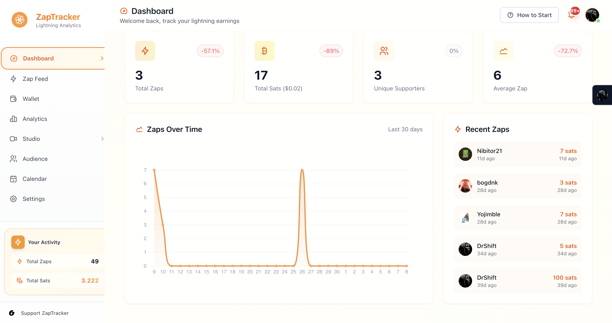
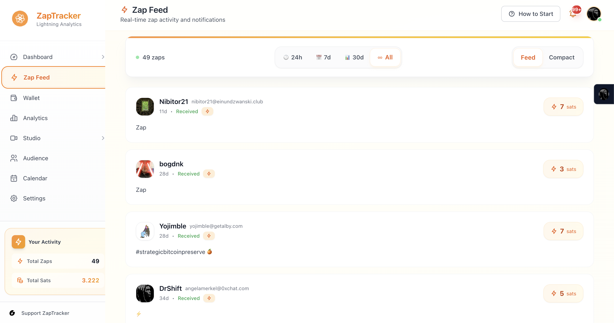
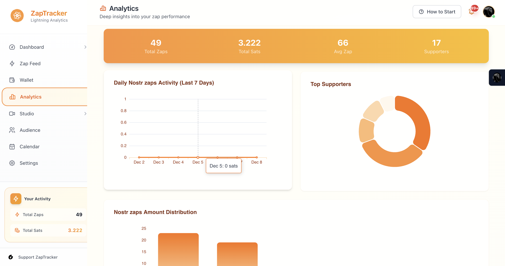
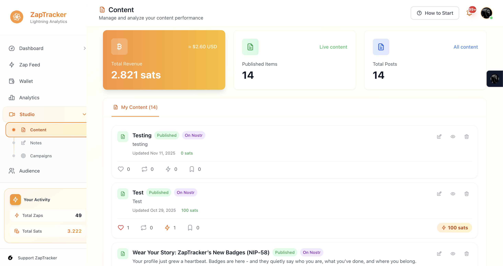
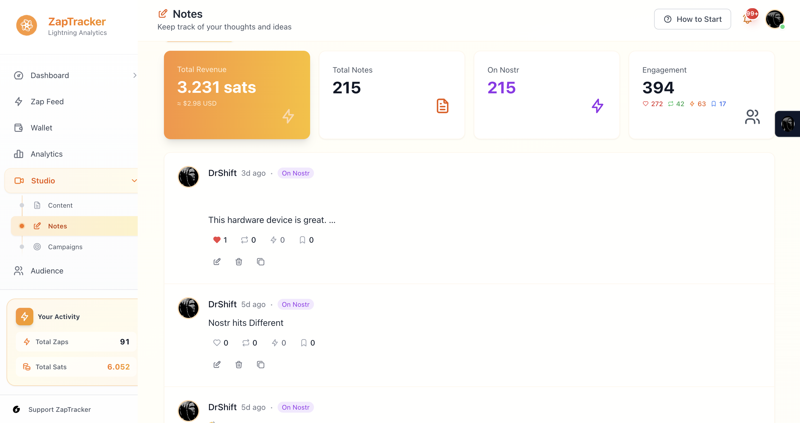
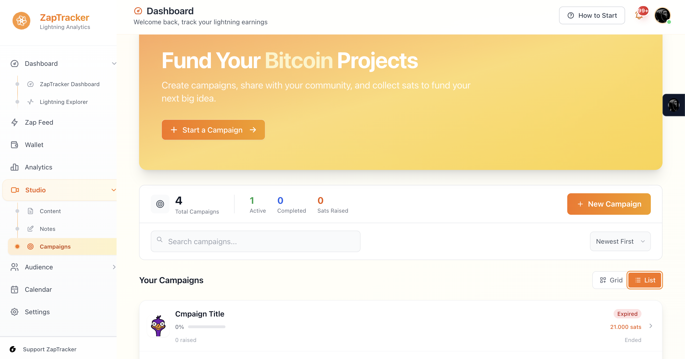
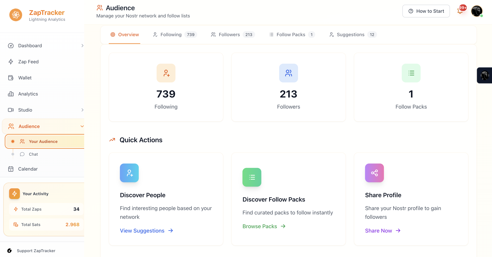
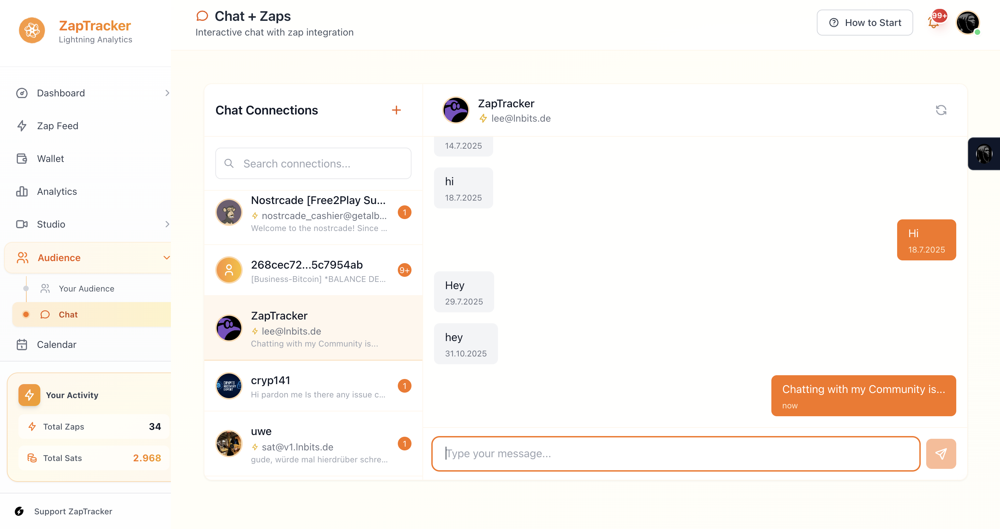
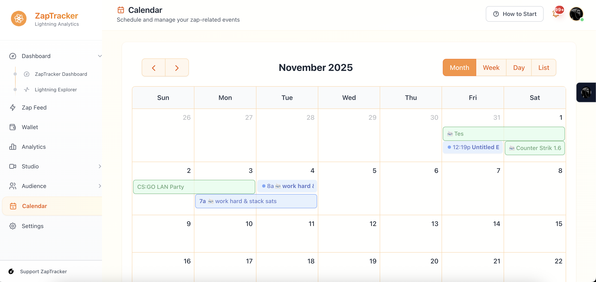

# ZapTracker Features

A complete walkthrough of every feature in ZapTracker.

> **Quick links:** [Home](../README.md) | [User Guide](../GUIDE.md) | [Use Cases](../use_cases.md)

---

## Dashboard

Your command center. See everything at a glance: total zaps, total sats, unique supporters, and average zap size. The 30-day activity chart shows trends over time, while the Recent Zaps sidebar keeps you updated on who's zapping you.

  

**Key metrics:**
- Total Zaps received
- Total Sats earned
- Unique Supporters count
- Average Zap amount
- Zaps Over Time chart (30 days)
- Recent Zaps with sender profiles

---

## Zap Feed

A real-time activity stream of every zap you receive. Filter by time range (24h, 7d, 30d, or all), switch between Feed and Compact views, and see sender profiles with Lightning addresses.

  

**Highlights:**
- Time-based filtering
- Feed vs Compact view toggle
- Sender profile display with avatars
- Zap amounts in sats

---

## Analytics

Deep insights into your zap performance. Visualize daily activity, see top supporters in a donut chart, and analyze zap amount distribution to understand your earning patterns.

  

**Charts & metrics:**
- Daily Nostr Zaps Activity (last 7 days)
- Top Supporters breakdown
- Zap Amount Distribution
- Summary stats: Total Zaps, Total Sats, Average Zap, Supporters

---

## Wallet

Manage your Bitcoin Lightning wallet directly inside ZapTracker via **Nostr Wallet Connect (NWC)**. Check balances, send and receive payments, generate QR codes, and browse transaction history -- all without leaving the dashboard.

**Supported wallets:** Alby, Buho, Coinos, LNBits, and any NWC-compatible wallet.

**Capabilities:**
- Real-time balance monitoring
- Send & receive Lightning payments
- QR code generation and scanning
- Full transaction history

> See the [Wallet Operations](../GUIDE.md#wallet-operations) section in the User Guide for setup instructions.

---

## Content Studio

Publish long-form articles using the **NIP-23** standard directly to Nostr relays. Track revenue and engagement per post with built-in analytics.

  

**Features:**
- Total Revenue tracking per content piece
- Published items count
- Publish status (Published / On Nostr)
- Revenue per post in sats

---

## Notes

Short-form content publishing to Nostr. Track your notes' performance with engagement metrics including reactions, reposts, replies, and zap revenue.

  

**Features:**
- Total Revenue from notes
- Total Notes count
- On-Nostr indicator
- Engagement score (reactions + reposts + replies + zaps)
- Edit, delete, and manage published notes

---

## Campaigns

Kickstarter-style fundraising powered by Bitcoin zaps. Create campaigns, set funding goals, share with your community, and track progress in real time.

  

**Features:**
- Create and manage multiple campaigns
- Track active, completed, and expired campaigns
- Total Sats Raised counter
- Grid and List view
- Search and sort campaigns

> See [Running Campaigns](../GUIDE.md#running-campaigns) in the User Guide for best practices.

---

## Audience

Grow and manage your Nostr network. See your following/follower counts, discover new people, curate Follow Packs, and share your profile to gain visibility.

  

**Features:**
- Following & Follower counts
- Follow Packs for curated lists
- Discover People suggestions
- Share Profile quick action
- Overview, Following, Followers, and Suggestions tabs

> Learn more about [growing your audience](../GUIDE.md#growing-your-audience).

---

## Chat + Zaps

Interactive messaging with built-in payment support. Chat with your community, request payments inline, and manage multiple conversations.

  

**Features:**
- Chat Connections sidebar
- Real-time messaging
- Payment request integration
- Search connections

---

## Calendar

Schedule and manage zap-related events with a full-featured calendar. Supports month, week, day, and list views.

  

**Features:**
- Month, Week, Day, and List views
- Create and manage events
- Color-coded event categories

---

## Media Library

Upload and manage media files via decentralized **Blossom** servers. Browse your uploads in grid or list view, filter by type (images, video, audio), preview in fullscreen, and manage files with bulk operations.

**Features:**
- Drag-and-drop upload
- Multi-server support
- Grid and list views
- Type filtering (images, video, audio)
- Fullscreen preview with keyboard navigation
- Copy URL, download, and bulk delete

> See [Media Management](../GUIDE.md#media-management) in the User Guide.

---

## MiniPoS

A lightweight point-of-sale interface for merchants accepting Bitcoin Lightning payments. Generate invoices, display QR codes, and confirm payments on the spot.

---

## Additional Features

- **Lightning Explorer** - Browse Lightning Network data from your dashboard
- **Invoice Share** - Create and share payment links
- **Content Unlock** - Gate exclusive content behind zap payments
- **Badges** - Display and manage your Nostr badges
- **Settings** - Configure Nostr identity, relay management, wallet connections, and preferences

---

  <a href="../README.md">Back to Home</a> &bull;
  <a href="../GUIDE.md">User Guide</a> &bull;
  <a href="../use_cases.md">Use Cases</a>

